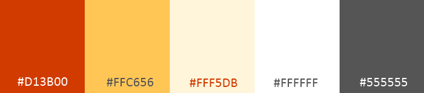

  

# Papeire

  

  

## Project in brief

  

Papeire is an online stationery shop that will sell handmade and vintage journals, papers and accessories. The idea for the shop was born in my mind a couple of years ago and stayed alive until today.

  

The name combines in a clever way word “paper” and “Eire” which is the Irish word for Ireland.

  

  

## UX

### Goals

#### User Goals

  

Groups targeted by Papeire are:

- People interested in making their own journalling experience using a selection of craft materials and products

- People following Instagram profiles and youtube accounts involved in creative journaling (like [@journalwithpurpose](https://www.instagram.com/journalwithpurpose/) or [Skylar Hand](https://www.youtube.com/channel/UCN1i6M8d1-80vy_DwTCf1VQ)

- People looking for unique handmade or vintage products

- People who prefer to support local artists and sellers instead of bigger firms and corporations

  

##### User goals are:

  

- Find a new journal for a bullet journal or a diary

- Find a gift for their crafty friend

- Buy a mystery grab bag containing curated elements for creative journaling

- Navigate the shop with ease and buy the things they need in a secure way

  

##### Papeire will meet these goals by:

  

- Being a //cameral// website, using design clues to cue the user they interact with an independent small shop

- Having navigation that contains only the necessary information for the users

- Presenting products with all the information user may need when choosing the product for purchase

- Providing easy access to product categories and products themselves, including search using keywords

- Having a flat rate for shipping worldwide - which means users can buy as much and as little as they need

  

#### Business Goals

##### Papeire business goals

  

- Provide a complete online shop that helps the user to browse, choose and buy products

- Make sure the users are feeling safe while completing a purchase

- Build the brand alongside an Instagram account

- Make sales easy and straightforward for buyers

  

### UX user stories

  

#### User Stories

A visitor to Papeire may expect, want or need:

  

- To have easy access to products overview and the expected style and feel that I can get from products

- Easy access to all the information I need - not only on available products but also on shipping and handling of the order

- Easy navigation that walks me through the whole process of choosing and purchasing the product, without frustration and confusion

- The ability to skim through a larger number of products but also to read detailed information on each one of these

- Responsiveness on any device, no matter its size or internet connection

- Content looking good and accessible

- Learn about the shop owner and their process of creation and preparation of product

- To be able to read reviews of the product previously purchased by other customers

- To understand how many items I'm buying and how many there are in stock

- To use search function allowing me to get results specific for my query

- To have easy access to frequently asked questions page that contains answers to the questions I may have when placing my order

- To be able to see clear and easy to understand summary of my order during the checkout process, including the total cost of the products and shipping rate

- To be able to access information about my previous orders and the status they are at

- To be able to find the shop’s Instagram profile and connect with the shop owner on another platform or to contact them using contact form embedded on the website

- To write reviews of the products I purchased

- To receive clear feedback whenever I take any action on the website - such as adding the product to the cart, changing its quantity, going through the checkout process, reviewing products or managing my account

  

## UI - design elements

### Fonts

  

Fonts used on the website are:

- Main header, headings and product links
[Fanwood Text](https://fonts.google.com/specimen/Fanwood+Text) backed up by Georgia and then default system serif font
- Content text (including text level links)
[Open Sans](https://fonts.google.com/specimen/Open+Sans) backed up by default system sans-serif font

### Colours palette

Colours used in this project are the following:

  

They were chosen based on how well they compliment vintage aesthetics, but at the same time, they are saturated enough to stand out and create the unique feel of the shop.

  

Colours combinations were checked against contrast issues and accessibility.

  

### Icons

  

This project uses Font Awesome icons. 
Following pages use icons to cue the user visually about what page they are on and what actions they can take:

- FAQ
- Contact me
- Sign up
- Log in
- Profile
- View order
- Cart
- Address details (part of checkout)
- Card payment details (part of checkout)
- 404 page

The icons are hidden on smaller screens to ensure the content is not overwhelmed by visual elements.  

### UI/UX differences between mockups and final version

Initial mockups were created using Figma and are available [here](https://www.figma.com/file/UmFDPng20jNh7YOAHgqtjS/stationery?node-id=0%3A1). Navigate between pages using the pages menu on the top of the left column.

The final product remained somehow faithful to the original idea, however, some deliberate changes were made to ensure better UX

## Planning and development process
I spent quite a lot of time trying out different models for database relations in the planning phase (and clearly not enough, for more details see [Lessons learned](#lessons-learned) section)

I visualised the relational schema using dbdiagram.io and it’s available at [https://dbdiagram.io/d/5dd5c301edf08a25543e2cd8](https://dbdiagram.io/d/5dd5c301edf08a25543e2cd8)

To track all features needing implementation, bugs, improvements and potential updates I used [Trello board](https://trello.com/b/xSgyQgU2/milestone-project-4) - with a clear process outlined by the tabs:

- To-Do - tab containing all the things needed to build the project from scratch, including not only backed and frontend but also documentation, testing and content
- In progress - tab containing things that I started to work on but are somewhere between 0% and 90% completed
- Almost done - things that need last tweaks and adjustment before being ready
- Done
- Need improving/fixing - house for any improvements and bugs found during development
- Future updates - things that are planned, but not necessary or not viable to present at the deadline for the project
- Trash can (not cannot) - potential elements, functions or changes that are not planned to appear in any time in the future - but may be if the specific need occurs.

The board uses following tags to split tasks into different categories: Planning, General functionality, Specific functionality, Improvement, BUG, Testing, Security, Lookin’ good (for styling), Content, Questions, Documentation  

## Features

### Features implemented

#### BACKEND

- Handles separate apps for different parts of the website:

- User authentication and data (including shipping address)

- Orders placed in the shop

- Product and their categories

- Keyword search

- Two stage checkout

- Static pages

- Database containing information on users, shipping addresses, products available, orders placed, rating of products etc.

- Allows sending emails to and from users (password reset + contact us form) using dedicated gmail account for the shop

  

#### FRONTEND

##### elements on every page:

- header ensuring clear identification
- simplistic navbar with search
- footer linking to all static pages providing more information and social media

##### Homepage/all products/categories/search results page:
- Contains distinct heading that allows user to identify what page they are looking at
- In left side column there is categories menu that allows the user to switch between them easily and sorting option to sort displayed products by price or date added
- Displays 4 elements in the row (on desktop, 2 elements on smaller screens, 1 element on the smallest screens).
  - each element consists of smaller picture of the product, its name that links to its detail page and button to add product to the cart
 
##### Detail page of single product
- Displays bigger picture for the product 
- Displays its price and full description and all necessary information
- Allows user to specify quantity of the product and add it to the cart
- Displays star rating that gathers votes from logged in users 
- Displays reviews that were written by users who purchased the product if there are any

##### User profile
- Is marked by icon clearly identifying it is profile page
- Shows user's orders and saved address if there are any
- Allows to view past orders and products that were purchased then 
- Links to procedure of requesting password reset

##### Static and authentication pages

- All contain icons for clear identification at what stage of authentication user is or what type of page they actually read
- Authentication pages display forms allowing user to go through entire process of authentication (first time or returning
- Static page display content that may be interesting for visitors that are unsure about buying in Papeire yet

  
  
  
  

### Features to be implemented

- More than one shipping address per user - it requires changing the relation between Address and Order models. The fact that current relation may not be suitable for business purposes was realised during only mid-development and due to time constraints was moved to planned update.

- Status of the order - it was initially planned as an implementation using mail carrier API and it was quickly abandonned due to the paywalls. However the idea of manually setting status of the order for user's peace of mind is still planned.

- Pagination - while it is a functionality that is native to any online shop, the store will probably have only a handful of products available at the same time, as they are handmade and available in very few copies. Pagination may be implemented in the future update if the number of products increases over ~15 unique products however at that point in time this functionality probably wouldn’t be active anyway, even if implemented.

- Discount + user coupons logic - to be implemented in the future. Products have now one field prepared for storing discount information.

- Better handling of URLs for categories - for now, the categories don’t have a slug and use category name to show the page. It shouldn’t cause problems with most if not all modern browsers, however using slugs could make it even more errorproof.

- Instagram feed overview of the hashtags used with the products pictures - this one requires Instagram content (pictures/posts) using #papeire and/or specific hashtag for the product. In brief, it’s supposed to gather posts showing the specific product and display them at the bottom of the product page.

- Multiple pictures for one product - this will be crucial for bigger handmade products (handbinded journal as opposed to sheet of stickers) and will be coming in the future updates. The implementation should be straightforward, as it requires only a duplication of the fields in the database and changing the frontend display by binding preview pictures to existing picture container and creating function that will allow going through all of them.

- Feedback messages moved to pop-ups instead of usual green or red bar on the top of the content - this one is tricky and I’m still not sure if viable to implement. Current feedback solution is traditional and users are used to it and uderstand the messages clearly. However moving some of the feedback to a modal or pop-up (for example when adding an item to the cart) could prove useful, as it is an element used by many online stores.

- Possibly index page different from all products page as it is now. The logic behind is implementend, only lack of sensible content (that wouldn't be just a placeholder) kept it in planning stage.

  

### Features that didn’t make it to the final cut (not implemented nor planned)

  

- is_digital - while initially was part of the Product model and it would specify if the product is eligible to digital download after the purchase, during the development I realised that there will probably no downloadable products in any near future. The field was removed from product table and won’t return in future updates

- stripe pre-built checkout page - could be an option to ensure users they are using a dedicated and secure element to handle their orders, however, the distinct look and possible incompatibility with current address and order way of storing data places it low on a priority list for now.

- all other elements at the last card of the [Trello page](https://trello.com/b/xSgyQgU2/milestone-project-4)

  

## Information architecture

  

Detailed database schema can be found at [https://dbdiagram.io/d/5dd5c301edf08a25543e2cd8](https://dbdiagram.io/d/5dd5c301edf08a25543e2cd8)

  

## Technologies used

  

- [Gitpod](https://gitpod.io) - IDE used for developing this project from scratch

- [Django 1.11.26](https://www.djangoproject.com/) - python web framework

- [Stripe](https://stripe.com/ie) - payment platform handling all validation and secure payments via credit card

- [Travis](http://travis-ci.org/) for continuous integration

- [Amazon Web Services](https://aws.amazon.com/s3/) - AWS S3 Bucket to store static files

- [Boto3](https://boto3.amazonaws.com/v1/documentation/api/latest/index.html) - creation and management of AWS S3

- [Heroku](https://www.heroku.com/home) - hosting of the website

- [Gunicorn](https://pypi.org/project/gunicorn/) - WSGI HTTP Server for UNIX

- [Pillow](https://pypi.org/project/Pillow/) - python imagining library to handle media upload

- [Psycopg2](https://pypi.org/project/psycopg2/)- PostgreSQL database adapter for Python

- [Git](https://git-scm.com/) and [GitHub](https://github.com/) - version control, storing and sharing the project code

- [Django countries](https://pypi.org/project/django-countries/) - providing country choices to use with forms

- [Django forms bootstrap](https://pypi.org/project/django-forms-bootstrap/) - form filter for using forms with bootstrap

- [Django star ratings](https://github.com/wildfish/django-star-ratings)

  
  

## Databases

- SQlite3 for development database (provided by django)

- PostgresSQL for production database (provided by heroku)

  

## Libraries

- Bootstrap to ensure responsiveness of the layout and for basic elements styling

- JQuery, scarcely, to simplify DOM manipulation, as a part of Bootstrap implementation

- Font Awesome to provide icons for Papeire

- Google Fonts to host and provide layout fonts

## Support applications

- [DBdiagram](https://dbdiagram.io/) for visual representation of database schema
- [Figma](https://www.figma.com/) for laying out initial mockups for the layout
- [StackEdit](https://stackedit.io/app#) for easy editing README file
- [Trello board](https://trello.com/) that didn't allow me to get lost, not even for a second

  

This project was built using HTML, CSS, Javascript and Python.

  

## Testing manual

  

[[user storeis testing]]

Tests run in different browsers, namely: Google Chrome, Mozilla Firefox, Microsoft Edge on desktop and Google Chrome and Samsung Internet on mobile

  

## Automated testing

This project wasn’t built using test driven development as it is hard to write tests for models and forms when still learning about htem :)
Unfortunately, I stood before a choice between pushing deadline further or omitting this part and submit the project on time. I chose the latter which is the shame, considering how easy to handle unittest is (yes, I've looked!) 

## Git version control / GitHub
### How to run this project locally

To run this project on your own IDE follow the instructions below:

- You must have installed PIP, Python 3 and Git on your machine/IDE
- To allow the website to work properly, ensure you have created Stripe account

### Instructions
Clone a repository using following command in the terminal `git clone https://github.com/Ardhanari/stationery.git`.

Install all required modules with the command `pip -r requirements.txt.`.

Set up the following environment variables within your IDE, you can use `.env` file to store those.
 

    SECRET_KEY: <your secret key> 
    STRIPE_PUBLISHABLE: <variable available after setting up Stripe account> 
    STRIPE_SECRETKEY: <as above>
    DEBUG: Boolean, True for development, False for production
    HOST: <address of your host>
    DATABASE_URL <needed if you use postgres, if Debug is True application will use local SQlite database>
    AWS_STORAGE_BUCKET_NAME: <your AWS storage bucket name> 
    AWS_SECRET_KEY_ID: <your AWS secret key ID>
    AWS_SECRET_ACCESS_KEY: <your AWS secret access key>

Part of the code in repository is adapted to work either in development and in production. These parts make possible to have different settings for two environments and are wrapped in `if development, else` and development sources its value directly from variable `DEBUG`. If you set DEBUG to True during the development, remember to set it back to False when deploying.

Migrate models using `python3 manage.py migrate`.

Create superuser using `python3 manage.py createsuperuser`. Follow the cues in the terminal providing login, e-mail address and password (password is being typed in even if it's not reflected on the screen). This user will have access to the admin panel and the database.

You can now run the program locally using `python3 manage.py runserver $IP:$PORT`command or similar, depending on the environment you're using.

Once it's running go use the local link and add `/admin/` at the end of the url. It will give you access to admin panel, where you can add first Product Categories and Products to the database.

  
  

## Deployment

  

To deploy Papeire to Heroku follow these steps:

  

In your terminal use command 'pip freeze --local > requirements.txt' to create a requirements.txt file (--local may be necessary when using cloud IDEs like AWS Cloud9 or GitPod to ensure only libraries used directly by the project are saved to the file)

  

Create a Procfile using command echo `web: gunicorn onlineshop.wsgi:application` where 'onlineshop' is the name of the application

  

Git add, git commit and git push these files to the repository

  

Create a new app on the Heroku, give it a name and choose region closest to you

  

From the heroku app dashboard in Deploy tab, in Deployment section select GitHub

  

Specify repository and the branch you want to use to deploy the project

On the Settings tab click on Reveal Config Vars and set following variables:

    AWS_ACCESS_KEY_ID <your  secret  key>
    AWS_SECRET_ACCESS_KEY <your  secret  key>
    AWS_STORAGE_BUCKET_NAME <your  AWS  S3  bucket  name>
    DATABASE_URL <your  postgres  database  url>
    EMAILJS_USER_ID <your  secret  key>
    HOSTNAME <your  heroku  app  hostname>
    SECRET_KEY <your  secret  key>
    STRIPE_PUBLISHABLE <your  secret  key>
    STRIPE_SECRET <your  secret  key>

[[ creating superuser heroku ]]

In your heroku dashboard, click "Deploy". Scroll down to "Manual Deploy", select the master branch then click "Deploy Branch".

Once the build succeed and is complete, click the "View app" button provided.

Your deployment is now done.

From the link provided add `/admin/` to the end of the url, log in with your superuser account and create first Product Categories and Products.

  

## Lessons learned

  

As this is the final project in Full-Stack Developer Course, there must be a chapter on lessons learned that this project brought.

  

The biggest one has its core in planning. I’ve learned hard way that having well-thought relational database schema is crucial to further development. And if I think I have a well-thought schema, I probably should think again, just to be sure. Adjusting and changing relations between tables, changing the type and amount of data they store and crossing out or adding new features based on database models took a lot of time when done during the development.

  

Planning of the development also didn’t take into account time needed for creating authentic content (pictures and texts for already available products). This oversight means that the currently deployed project uses pictures on the free license and texts not reflecting actual products

  

## Credits, acknowledgements and all fun stuff

**Papeire** may be written by one developer but wouldn't exist without: 

Stijn Van De Vyver who is 100% responsible for creative side of inventing the name.

All beloved people that offered advice and time for testing the website. Biggest thanks to Kuba Kołaciński, Stijn Van De Vyver and Tomasz Rębas for their support (technical and mental alike) .

[Code Institute](http://codeinstitute.net/) lessons, tutors and community. They were an enormous help during learning process and development this and all past projects.

[Oluwaseun Owonikoko](https://ng.linkedin.com/in/oluwaseun-owonikoko-190318135) for mentoring and help provided during development and sense of humour. 

[Unsplash](https://unsplash.com) authors, mainly [Joanna Kosinska](https://unsplash.com/@joannakosinska), [Ana Juma](https://unsplash.com/@anajuma), [Jen Theodore](https://unsplash.com/@jentheodore), [Simon Matzinger](https://unsplash.com/@8moments), providing all the placeholder pictures for the live project. 
  

#### This is Milestone Project 4 for Code Institute Full Stack Developer Course.

#### Author: Katarzyna Sapa

Feel free to contact me at `katarzyna dot sapa at gmail dot com`